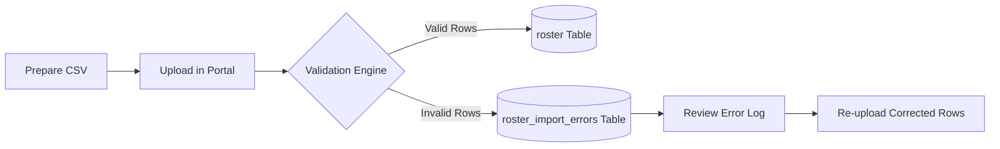
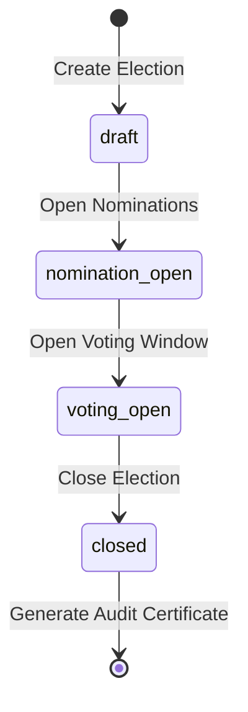

# Administrator Operations & Governance Guide

This guide provides end-to-end instructions for **Institution Administrators** and **Department Administrators** to configure campus tenants, ingest voter rosters, manage candidate approvals, run elections, and generate audit reports.

---

## 1. Institution Admin Onboarding

### 1.1 Self-Serve Registration
1. Navigate to `/signup`.
2. Enter your **Institution Name** (e.g. `State University`). The system automatically generates a URL slug (e.g. `state-university`) and verifies availability in real-time.
3. Enter your official administrator email address and click **Send OTP**.
4. Enter the 6-digit code received in your inbox.
5. The system atomically provisions your institution tenant and grants you the `institution_admin` role.

---

## 2. Voter Roster CSV Ingestion

The student roster acts as the single source of truth for voting eligibility.



### 2.1 CSV Formatting Requirements
Your CSV file **must** include the following exact header row:

```csv
roll_no,email,department,year,full_name
CS2026-001,alice@univ.edu,Computer Science,2,Alice Walker
EE2025-042,bob@univ.edu,Electrical Engineering,3,Bob Zhang
ME2024-110,clara@univ.edu,Mechanical Engineering,4,Clara Oswald
```

#### Column Specifications
| Column Header | Data Type | Required | Notes / Validation Rules |
| :--- | :--- | :---: | :--- |
| `roll_no` | Text | Yes | Alphanumeric student ID. Cannot be blank. |
| `email` | Text | Yes | Valid email syntax. Unique per institution. |
| `department` | Text | Yes | Exact department name (case-sensitive matching). |
| `year` | Integer | Yes | Numerical academic year (e.g., `1`, `2`, `3`, `4`). |
| `full_name` | Text | No | Student's full display name. |

### 2.2 Handling Import Errors
If the CSV contains malformed records (e.g., missing year or invalid email), valid rows are imported immediately while invalid rows are isolated into the **Import Error History** table.
- View the row number and specific error reason in your dashboard.
- Fix the flagged rows in your spreadsheet and upload the corrected subset.

---

## 3. Delegating Department Administrators

Institution Admins can delegate management of departmental elections:
1. Under **Invite Admin**, enter the faculty member's official email.
2. Select their designated **Department** from the dropdown.
3. Click **Send Invitation**.
4. When the Department Admin signs in, their dashboard is automatically scoped exclusively to their assigned department.

---

## 4. Election Lifecycle Management

Elections follow a strict 4-phase state machine:

```
[draft] ──► [nomination_open] ──► [voting_open] ──► [closed]
```



### State Definitions
1. **`draft`**: Configuration phase. The election is hidden from student voters. Title, scopes, and date windows can be updated.
2. **`nomination_open`**: Eligible students can submit self-nominations, manifestos, and headshots.
3. **`voting_open`**: Ballots are live. Eligible students cast exactly one vote. Tallies remain strictly hidden.
4. **`closed`**: Voting is permanently terminated. Results become public, and the cryptographic audit report is generated.

### Scoping Elections
- **Institution-Wide Election**: Leave `scope_department` and `scope_year` empty. All enrolled students in the roster are eligible.
- **Department-Scoped Election**: Set `scope_department` (e.g. `Computer Science`). Only students in that department can nominate or vote.
- **Class-Scoped Election**: Set both `scope_department` and `scope_year` (e.g. `Mechanical Engineering`, Year `3`).

---

## 5. Candidate Review & Governance

1. In the **Pending Candidates** card, click on any nominee to review their:
   - Full Name & Roll Number
   - Department & Eligibility
   - Submitted Manifesto
   - Campaign Photograph
2. Click **Approve** to publish the candidate onto the live ballot, or **Reject** to deny the nomination.

---

## 6. Audit Certificates & Compliance Reporting

Once an election enters `closed` status:
1. Navigate to the election card and click **Audit Certificate**.
2. Review the official summary:
   - Total Eligible Voters vs. Votes Cast
   - Turnout Percentage (%)
   - Final Candidate Tallies & Declared Winner
   - **SHA-256 Cryptographic Integrity Hash**
3. Click **Print Certificate** to export an official PDF record for campus archives and student government records.
