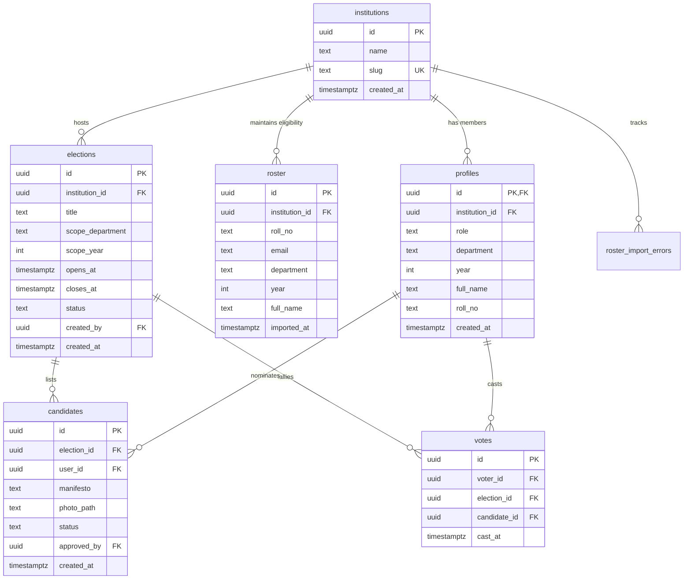
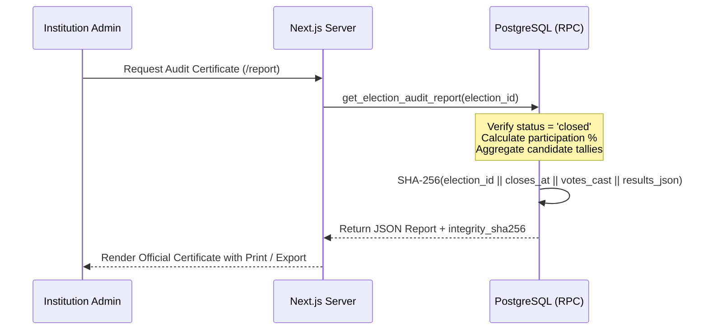

# System Architecture & Multi-Tenant Security Model

This document outlines the architecture, data models, row-level security (RLS) policies, cryptographic audit trails, and multi-tenant isolation mechanisms of the Online Voting System platform.

---

## 1. High-Level Architecture Overview

The system is architected as a secure multi-tenant SaaS application built on **Next.js 14 App Router** and **Supabase (PostgreSQL 15+)**. It guarantees data privacy, role-based boundary enforcement, and ballot confidentiality directly at the database layer rather than relying solely on application middleware.

```mermaid
graph TD
    Client[Next.js 14 Frontend / SSR & RSC] -->|Supabase Auth / SSR Client| SupabaseGate[Supabase API Gateway]
    SupabaseGate -->|JWT Context / auth.uid| PostgresDB[(PostgreSQL 15+ Engine)]
    SupabaseGate -->|Edge Ingestion| EdgeFn[Supabase Edge Functions]
    EdgeFn -->|Service Role / Batch Validate| PostgresDB
    
    subgraph PostgreSQL Database Layer
        RLS[Row Level Security Engine]
        Tables[institutions | profiles | roster | elections | candidates | votes]
        RPC[Security Definer RPCs]
        Storage[(candidate-photos Bucket)]
    end
    
    PostgresDB --> RLS
    RLS --> Tables
    PostgresDB --> RPC
```

---

## 2. Multi-Tenant Role & Permission Hierarchy

The system enforces a 4-tier role hierarchy. Every record in child tables (`profiles`, `roster`, `elections`, `candidates`, `votes`, `roster_import_errors`) is strictly scoped by `institution_id`.

```
Platform Admin (Role: platform_admin)
  │── Cross-institution oversight via aggregate RPCs only
  └── Zero access to student PII, roster rows, or individual ballot records
       │
Institution Admin (Role: institution_admin)
  │── Full administrative authority over a single institution
  │── Manages student roster CSV ingestion and import error logs
  │── Creates institution-wide elections and invites Department Admins
  └── Accesses closed-election audit certificates and turnout reports
       │
Department Admin (Role: department_admin)
  │── Scoped strictly to their assigned academic department
  │── Creates department-scoped elections (e.g. CS Council, Mechanical Rep)
  └── Approves / rejects candidate nominations within their department
       │
Voter / Student Nominee (Role: voter)
  │── Claims eligibility via roster matching on initial passwordless OTP login
  │── Self-nominates for open elections (manifesto + headshot upload)
  └── Casts exactly 1 ballot per eligible election (DB-enforced)
```

### Granular Permission Matrix

| Capability / Resource | Platform Admin | Institution Admin | Dept Admin | Student Voter |
| :--- | :---: | :---: | :---: | :---: |
| **Self-Serve Institution Creation** | — *(Public)* | — | — | — |
| **Roster CSV Upload & Error Inspection** | ❌ | ✅ *(Own institution)* | ❌ | ❌ |
| **Invite Department Admin** | ❌ | ✅ | ❌ | ❌ |
| **Create Institution-Wide Election** | ❌ | ✅ | ❌ | ❌ |
| **Create Dept-Scoped Election** | ❌ | ✅ | ✅ *(Own dept only)* | ❌ |
| **Approve / Reject Candidate Nominations** | ❌ | ✅ *(All dept elections)* | ✅ *(Own dept only)* | ❌ |
| **Submit Candidate Nomination** | ❌ | ❌ | ❌ | ✅ *(Eligible + Open)* |
| **Cast Ballot** | ❌ | ❌ | ❌ | ✅ *(Eligible + Open)* |
| **View Audit Certificate / Results** | ✅ *(Audit RPC)* | ✅ *(Audit RPC)* | ❌ *(Locked till close)* | ❌ *(Locked till close)* |
| **Cross-Tenant Aggregate Metrics** | ✅ *(RPC only)* | ❌ | ❌ | ❌ |

---

## 3. Database Schema & Relational Integrity

### Entity Relationship Diagram (ERD)



### Table Specifications & Constraints

1. **`institutions`**: Tenant root. `slug` is unique, URL-safe, and used in tenant identification.
2. **`profiles`**: Primary user identity, 1:1 with `auth.users`. Contains `role` (`platform_admin`, `institution_admin`, `department_admin`, `voter`), `department`, and `year`.
3. **`roster`**: The authoritative student eligibility list. Unique constraint on `(institution_id, email)` prevents duplicate voter claims across an institution.
4. **`elections`**: Election governance records. `scope_department` (NULL = all) and `scope_year` (NULL = all) dictate eligibility. State machine: `draft` → `nomination_open` → `voting_open` → `closed`.
5. **`candidates`**: Nominations submitted by voters. Unique constraint on `(election_id, user_id)` ensures a user cannot submit multiple nominations for the same ballot.
6. **`votes`**: Ballot ledger. Unique constraint on `(voter_id, election_id)` guarantees at the database engine level that no user can vote more than once per election.
7. **`roster_import_errors`**: Audit log of malformed rows during CSV uploads (e.g. invalid email format, missing year).

---

## 4. Row Level Security (RLS) Policy Architecture

Every table operates with Row Level Security explicitly enabled (`ALTER TABLE ... ENABLE ROW LEVEL SECURITY`).

```sql
-- Helper functions for active tenant and role
CREATE OR REPLACE FUNCTION my_institution_id() RETURNS uuid AS $$
  SELECT institution_id FROM profiles WHERE id = auth.uid();
$$ LANGUAGE sql SECURITY DEFINER STABLE;

CREATE OR REPLACE FUNCTION my_role() RETURNS text AS $$
  SELECT role FROM profiles WHERE id = auth.uid();
$$ LANGUAGE sql SECURITY DEFINER STABLE;
```

### Security Defenses & Leak Prevention

| Defense Scenario | Mechanism & RLS Policy | Outcome |
| :--- | :--- | :--- |
| **Tenant Hopping** | `institutions_select` & `profiles_select` filter on `my_institution_id()` | Authenticated users cannot query or enumerate records from other institutions. |
| **Premature Ballot Visibility** | `get_election_results` RPC checks `status = 'closed'` | Voters cannot view live tallies during active voting, preventing herd mentality. |
| **Double-Vote Tampering** | PostgreSQL constraint `UNIQUE(voter_id, election_id)` | Attempted second vote throws SQL error `23505` and is immediately rejected. |
| **Unauthorized Ballot Insertion** | `votes_insert` checks `elections.status = 'voting_open'` and eligibility matching | Inserting votes into closed or mismatched elections is blocked by RLS. |
| **Privilege Escalation** | `profiles_update_own` restricts update to non-role, non-tenant columns | Users cannot modify their own `role` or `institution_id`. |
| **Ballot Anonymity** | `votes_own_read` restricts select to `voter_id = auth.uid()` | Admins and other voters can never query who another student voted for. |

---

## 5. Cryptographic Audit Trail & Integrity Hashing

To satisfy university election bylaws and external audits, the system implements a tamper-evident audit report generated via `get_election_audit_report(p_election_id)`.



### Integrity Hash Formula
```
integrity_sha256 = encode(
  sha256(
    (p_election_id::text || ':' || v_election.closes_at::text || ':' || v_votes_cast::text || ':' || v_results::text)::bytea
  ),
  'hex'
)
```
Any modification to the underlying vote counts or election timestamps invalidates the SHA-256 integrity signature.
