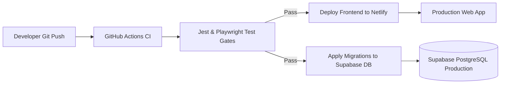

# Deployment, CI/CD & Operations Runbook

This runbook documents the deployment architecture, continuous integration pipelines, environment configuration, database migrations, and operational procedures for the Online Voting System.

---

## 1. Environment & Infrastructure Overview

- **Frontend Hosting**: Netlify / Vercel (Next.js 14 App Router, Node.js 20+)
- **Backend & Database**: Supabase Cloud (PostgreSQL 15+, Auth, Storage, Edge Functions)
- **CI/CD Pipeline**: GitHub Actions (Linting, TypeScript compilation, Jest unit tests, Playwright E2E tests, Supabase DB migration verify)



---

## 2. Environment Variables Configuration

Create a `.env.local` file for local development. In production, configure these variables in the hosting provider dashboard.

```env
# Public Supabase Connection
NEXT_PUBLIC_SUPABASE_URL=https://your-project-ref.supabase.co
NEXT_PUBLIC_SUPABASE_ANON_KEY=your-anon-public-key

# Netlify / Production Site URL
NEXT_PUBLIC_SITE_URL=https://your-domain.com
```

> [!CAUTION]
> **Service Role Key Hygiene**: The `service_role` secret key must **never** be placed in `.env.local` or client bundles. It is reserved exclusively for Supabase Edge Functions and secure CI/CD runners.

---

## 3. Database Migration Workflow

All schema and RLS modifications are managed through versioned SQL migrations in `supabase/migrations/`.

### Applying Migrations Locally (Docker Stack)
```bash
supabase start
supabase db reset
```

### Applying Migrations to Remote Dev / Staging
```bash
supabase login
supabase link --project-ref <dev-project-ref>
supabase db push
```

### Deploying Edge Functions
```bash
supabase functions deploy roster-csv-validate
```

---

## 4. Quality Gates & Automated CI Pipeline

A deployment pipeline runs on every pull request to ensure zero regressions in security and voting integrity:

```bash
# 1. Linting and type-checking
npm run lint
npx tsc --noEmit

# 2. Unit and Integration tests
npm run test

# 3. End-to-End Browser Tests
npx playwright test
```

### Non-Negotiable Test Criteria Before Deploying
1. **Double-Vote Rejection**: Second vote for the same `(voter_id, election_id)` is rejected by database constraint.
2. **Closed-Election Rejection**: Vote insert is blocked by RLS when election status is not `voting_open`.
3. **Tally Accuracy**: `get_election_results()` matches exact hand-computed test ballots.
4. **Tenant Isolation**: Institution A authenticated user cannot query or modify Institution B data.

---

## 5. Backup & Disaster Recovery

- **Automated Snapshots**: Daily Supabase automated backups with point-in-time recovery (PITR) enabled.
- **Roster Export**: Institution admins can re-ingest student rosters at any time without data corruption due to `(institution_id, email)` uniqueness constraints.
- **Audit Reports**: Final closed election reports include immutable SHA-256 hashes for independent verification.
