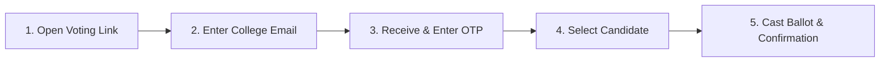
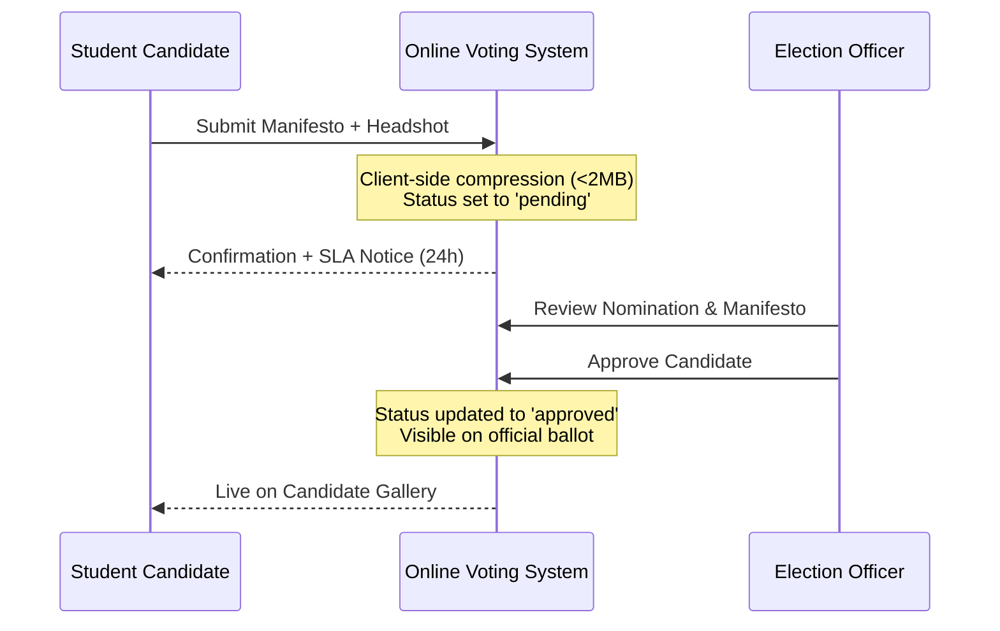

# Student Voter & Candidate Handbook

This guide explains how enrolled students can authenticate, verify voting eligibility, cast secure ballots, submit self-nominations, and inspect election results.

---

## 1. Quick Start: Casting Your Ballot in < 60 Seconds

### Step-by-Step Instructions
1. **Access the Portal**: Open the voting link sent by your university or visit the homepage and click **Sign In**.
2. **Select Your College**: If not pre-selected from your link, choose your university from the directory.
3. **Passwordless OTP Login**: Enter your official student email address (e.g., `maya@univ.edu`) and click **Send OTP**.
4. **Enter Verification Code**: Check your email for the 6-digit code and submit it. No password or student ID memorization is required.
5. **View Eligible Elections**: Your dashboard displays only the elections you are eligible for based on your department and academic year.
6. **Cast Your Vote**: Click **Vote Now**, review candidate profiles and manifestos, select your choice, and click **Cast Vote**.

> [!NOTE]
> **One Vote Guarantee**: The platform enforces a strict one-vote constraint at the database engine level. Once your ballot is cast, it cannot be modified, and duplicate attempts will be rejected.

---

## 2. Running for Office: Candidate Self-Nomination

If an election is currently in the **Nominations Open** phase, eligible students can run for office.

### 2.1 Nomination Requirements
1. Navigate to the election card and click **Self-Nominate**.
2. **Write Your Manifesto**: Up to 1,000 characters. *Tip: Keep your core platform and priorities in the first two sentences, as ballots show a preview.*
3. **Upload Your Photo** (Optional):
   - Formats: JPEG, PNG, or WebP.
   - Max file size: 2 MB (the browser automatically compresses high-res images).
   - Live square crop preview ensures your photo displays cleanly on ballots.
4. Click **Submit Nomination**.

### 2.2 Nomination Review & Approval
- Your nomination is tagged with a yellow `PENDING` badge.
- Only you and election administrators can view your pending nomination.
- Once reviewed and approved by the election committee (typically within 24 hours), your profile is published to the **Candidates Gallery** and added to the official ballot.

---

## 3. Viewing Election Results

- **During Active Voting**: To eliminate bandwagon bias and maintain voter privacy, tallies are cryptographically locked while voting is open. Live countdown timers show when the ballot box closes.
- **After Election Closes**: The **Results** tab activates immediately, displaying the declared winner, vote distributions, turnout percentage, and graphical charts.
