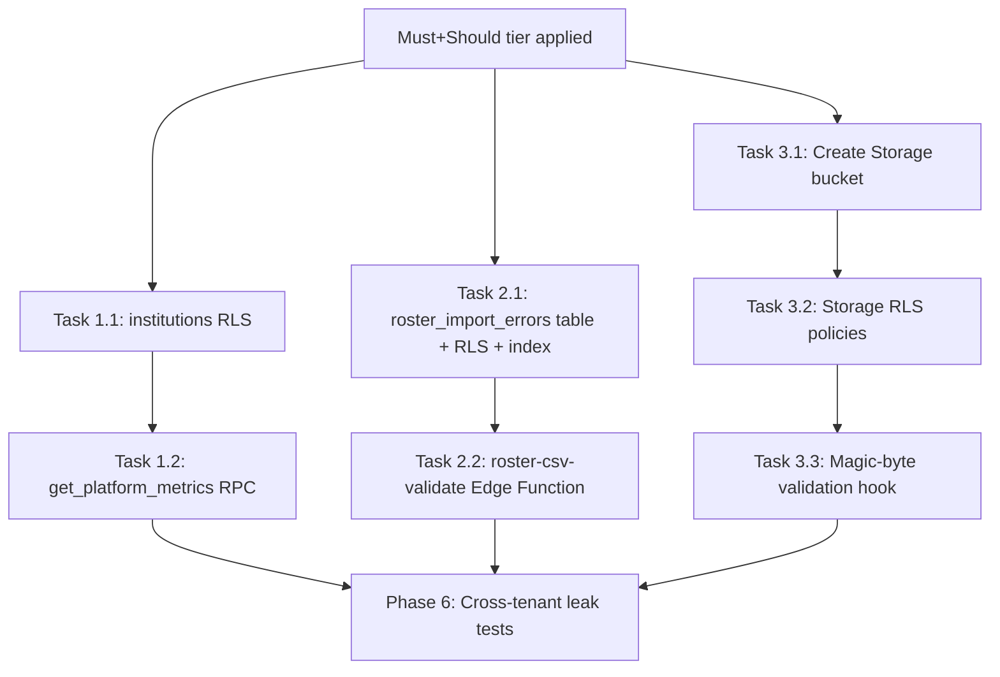

# Tasks — Could-Tier Extensions (voting-platform-v1)

> **Prerequisite**: All Must-tier and Should-tier schema/RLS from AGENTS.md must be applied before these tasks. These tasks are additive only — they never modify locked tables or policies.

---

## Task 1: Platform Admin Aggregate RPC

### 1.1 Enable RLS on `institutions` table

**Migration file**: `supabase/migrations/<timestamp>_enable_institutions_rls.sql`

```sql
-- Enable RLS on institutions (currently has no policies)
alter table institutions enable row level security;

-- Platform admin sees all institutions; everyone else sees only their own
create policy institutions_select on institutions
  for select using (
    my_role() = 'platform_admin'
    or id = my_institution_id()
  );
```

**Depends on**: `my_role()` and `my_institution_id()` helper functions (Must-tier).

**Phase 6 test cases**:
- **PA-5**: Voter queries `SELECT * FROM institutions` → only their own institution row returned.
- Verify `platform_admin` sees all institution rows.

---

### 1.2 Create `get_platform_metrics()` RPC

**Migration file**: `supabase/migrations/<timestamp>_create_get_platform_metrics.sql`

```sql
create or replace function get_platform_metrics()
returns table (
  institution_id   uuid,
  institution_name text,
  total_elections  bigint,
  active_elections bigint,
  closed_elections bigint,
  total_voters     bigint,
  total_votes_cast bigint,
  participation_pct numeric
) as $$
begin
  -- Gate: only platform_admin may call this
  if my_role() != 'platform_admin' then
    raise exception 'Access denied: platform_admin role required';
  end if;

  return query
  select
    i.id                                         as institution_id,
    i.name                                       as institution_name,
    count(distinct e.id)                         as total_elections,
    count(distinct e.id) filter (
      where e.status = 'voting_open')            as active_elections,
    count(distinct e.id) filter (
      where e.status = 'closed')                 as closed_elections,
    (select count(*) from roster r
     where r.institution_id = i.id)              as total_voters,
    count(distinct v.id)                         as total_votes_cast,
    round(
      count(distinct v.id)::numeric /
      nullif(
        (select count(*) from roster r2
         where r2.institution_id = i.id) *
        nullif(count(distinct e.id) filter (
          where e.status in ('voting_open','closed')), 0),
        0
      ) * 100,
      2
    )                                            as participation_pct
  from institutions i
  left join elections e on e.institution_id = i.id
  left join votes v     on v.election_id = e.id
  group by i.id, i.name
  order by i.name;
end;
$$ language plpgsql security definer stable;
```

**Phase 6 test cases**:
- **PA-1**: Call as `institution_admin` → expect `Access denied` exception.
- **PA-2**: As `platform_admin`, run `SELECT * FROM votes` → expect 0 rows (raw access still blocked).
- **PA-3**: As `platform_admin`, run `SELECT * FROM roster` → expect 0 rows (PII still blocked).
- **PA-4**: Call as `institution_admin` → expect `Access denied` exception (same as PA-1, but confirms from a different institution context).
- Positive test: Call as `platform_admin` with 2+ seeded institutions → verify returned `institution_name`, `total_elections`, `total_votes_cast` match hand-computed values.

---

## Task 2: Roster Import Errors — Table, RLS, Indexes

### 2.1 Create `roster_import_errors` table + RLS

**Migration file**: `supabase/migrations/<timestamp>_create_roster_import_errors.sql`

```sql
-- roster_import_errors table (reproducing locked schema from AGENTS.md)
create table roster_import_errors (
  id uuid primary key default gen_random_uuid(),
  institution_id uuid references institutions(id) not null,
  row_number int not null,
  raw_row jsonb not null,
  error_reason text not null,
  imported_at timestamptz default now()
);

-- RLS: same access pattern as roster (institution_admin of own institution only)
alter table roster_import_errors enable row level security;

create policy roster_import_errors_admin_access on roster_import_errors
  for all using (
    institution_id = my_institution_id()
    and my_role() in ('institution_admin')
  );

-- Performance index for admin queries
create index idx_roster_import_errors_institution_imported
  on roster_import_errors(institution_id, imported_at desc);
```

**Phase 6 test cases**:
- **RIE-1**: Inst A admin queries → only Inst A rows. Inst B rows invisible.
- **RIE-2**: Voter / department_admin queries → 0 rows.
- **RIE-3**: Anonymous / unauthenticated query → 0 rows.
- **RIE-4**: Inst A admin attempts `INSERT ... institution_id = <Inst B>` → RLS violation.

---

### 2.2 Create Edge Function `roster-csv-validate`

**File**: `supabase/functions/roster-csv-validate/index.ts`

**Contract**:
- **Input**: Multipart form upload with CSV file + `institution_id` parameter.
- **Auth**: Requires valid JWT. Edge Function verifies caller is `institution_admin` for the given `institution_id` using the `service_role` key internally.
- **Processing**: For each CSV row:
  1. Validate: email format, department not empty, roll_no not empty, year is integer.
  2. Check for in-batch duplicates (email, roll_no).
  3. Valid rows → `INSERT INTO roster ... ON CONFLICT (institution_id, email) DO UPDATE`.
  4. Invalid rows → `INSERT INTO roster_import_errors`.
- **Output**: JSON `{ inserted: number, errors: number, error_details: { row_number, error_reason }[] }`.
- **Security**: Uses `service_role` key (from Edge Function secrets, never client-exposed). Validates caller role server-side before processing.

**Validation rules**:

| Rule | `error_reason` value |
|---|---|
| Missing/empty email | `missing_email` |
| Malformed email | `invalid_email_format` |
| Missing/empty department | `missing_department` |
| Missing/empty roll_no | `missing_roll_no` |
| Missing/non-integer year | `invalid_year` |
| Duplicate email in same CSV batch | `duplicate_email_in_batch` |
| Duplicate roll_no in same CSV batch | `duplicate_roll_no_in_batch` |
| Email already exists in `roster` for this institution | `duplicate_email_existing` |

**Implementation notes**:
- Parse CSV using a streaming parser (e.g., `csv-parse`) to handle large files.
- Process in a single DB transaction: if the batch has critical structural issues (no headers, wrong encoding), reject the entire upload before inserting anything.
- The `service_role` key never leaves the Edge Function runtime — it is set via `supabase secrets set SERVICE_ROLE_KEY=...`.

---

## Task 3: Candidate Photo Storage

### 3.1 Create Storage bucket

**Via Supabase Dashboard or migration**:

```sql
-- Create the bucket (run via supabase CLI or dashboard)
insert into storage.buckets (id, name, public, file_size_limit, allowed_mime_types)
values (
  'candidate-photos',
  'candidate-photos',
  false,
  2097152,  -- 2 MB
  array['image/jpeg', 'image/png', 'image/webp']
);
```

---

### 3.2 Create Storage RLS policies

**Migration file**: `supabase/migrations/<timestamp>_create_candidate_photo_storage_policies.sql`

```sql
-- Upload: candidates upload their own photo during nomination_open
create policy storage_candidate_photo_insert
  on storage.objects for insert
  with check (
    bucket_id = 'candidate-photos'
    and (storage.foldername(name))[3] = auth.uid()::text
    and (storage.foldername(name))[1] = my_institution_id()::text
    and exists (
      select 1 from candidates c
      join elections e on e.id = c.election_id
      where c.user_id = auth.uid()
        and c.election_id = ((storage.foldername(name))[2])::uuid
        and e.institution_id = my_institution_id()
        and e.status = 'nomination_open'
    )
  );

-- Replace: candidates can replace their photo while nomination is open and status is pending
create policy storage_candidate_photo_update
  on storage.objects for update
  using (
    bucket_id = 'candidate-photos'
    and (storage.foldername(name))[3] = auth.uid()::text
    and (storage.foldername(name))[1] = my_institution_id()::text
    and exists (
      select 1 from candidates c
      join elections e on e.id = c.election_id
      where c.user_id = auth.uid()
        and c.election_id = ((storage.foldername(name))[2])::uuid
        and e.institution_id = my_institution_id()
        and e.status = 'nomination_open'
        and c.status = 'pending'
    )
  );

-- Read: approved photos visible to whole institution; pending/rejected only to candidate + admins
create policy storage_candidate_photo_select
  on storage.objects for select
  using (
    bucket_id = 'candidate-photos'
    and (storage.foldername(name))[1] = my_institution_id()::text
    and (
      exists (
        select 1 from candidates c
        join elections e on e.id = c.election_id
        where c.election_id = ((storage.foldername(name))[2])::uuid
          and c.user_id = ((storage.foldername(name))[3])::uuid
          and c.status = 'approved'
          and e.institution_id = my_institution_id()
      )
      or (storage.foldername(name))[3] = auth.uid()::text
      or my_role() in ('institution_admin', 'department_admin')
    )
  );

-- Delete: only institution_admin can delete photos
create policy storage_candidate_photo_delete
  on storage.objects for delete
  using (
    bucket_id = 'candidate-photos'
    and (storage.foldername(name))[1] = my_institution_id()::text
    and my_role() in ('institution_admin')
  );
```

**Phase 6 test cases**:
- **CP-1**: Inst A voter reads Inst B candidate photo → 403.
- **CP-2**: Voter reads pending candidate photo (not their own) → 403.
- **CP-3**: Candidate uploads with Inst B's `institution_id` in path → RLS violation.
- **CP-4**: Candidate uploads with another user's UUID in path → RLS violation.
- **CP-5**: Upload `.exe` renamed to `.jpg` → rejected by MIME/magic-byte check.
- **CP-6**: Upload 50 MB file → rejected by `file_size_limit`.
- **CP-7**: Non-candidate voter uploads to valid-looking path → RLS violation (no `candidates` row exists).
- **CP-8**: Candidate uploads when election is `voting_open` (not `nomination_open`) → RLS violation.
- Positive test: Candidate uploads during `nomination_open` → succeeds. After approval, any institution voter can read the photo.

---

### 3.3 Edge Function hook for magic-byte validation (optional hardening)

**File**: `supabase/functions/validate-candidate-photo/index.ts`

**Contract**:
- Triggered as a Storage event hook on `INSERT` to `candidate-photos` bucket.
- Reads the first 12 bytes of the uploaded object.
- Validates that the magic bytes match the declared `content-type`:
  - JPEG: `FF D8 FF`
  - PNG: `89 50 4E 47 0D 0A 1A 0A`
  - WebP: `52 49 46 46 xx xx xx xx 57 45 42 50`
- If mismatch: deletes the object and logs a warning.
- Uses `service_role` key internally for the delete operation.

---

## Task execution order



Tasks 1, 2, and 3 are independent of each other and can be parallelized. Within each task, sub-tasks must be sequential.

---

## Phase 6 test case master list

All test cases from `design.md` §5.4, §6.6, §7.7 consolidated:

### Platform Admin RPC (PA-*)
| ID | Description | Expected result |
|---|---|---|
| PA-1 | `institution_admin` calls `get_platform_metrics()` | `Access denied` exception |
| PA-2 | `platform_admin` runs `SELECT * FROM votes` | 0 rows |
| PA-3 | `platform_admin` runs `SELECT * FROM roster` | 0 rows |
| PA-4 | `institution_admin` calls `get_platform_metrics()` (from different institution) | `Access denied` exception |
| PA-5 | Voter queries `SELECT * FROM institutions` | Only own institution row |

### Roster Import Errors (RIE-*)
| ID | Description | Expected result |
|---|---|---|
| RIE-1 | Inst A admin queries `roster_import_errors` | Only Inst A rows |
| RIE-2 | Voter / dept_admin queries `roster_import_errors` | 0 rows |
| RIE-3 | Anon / unauthenticated queries `roster_import_errors` | 0 rows |
| RIE-4 | Inst A admin inserts with Inst B's `institution_id` | RLS violation |

### Candidate Photos (CP-*)
| ID | Description | Expected result |
|---|---|---|
| CP-1 | Inst A voter reads Inst B candidate photo | 403 |
| CP-2 | Voter reads pending candidate photo (not their own) | 403 |
| CP-3 | Candidate uploads with wrong `institution_id` in path | RLS violation |
| CP-4 | Candidate uploads with another user's UUID in path | RLS violation |
| CP-5 | Upload content-type mismatch (`.exe` as `.jpg`) | Rejected |
| CP-6 | Upload exceeds 2 MB limit | 413 / rejection |
| CP-7 | Non-candidate uploads to valid-looking path | RLS violation |
| CP-8 | Candidate uploads when election not `nomination_open` | RLS violation |
